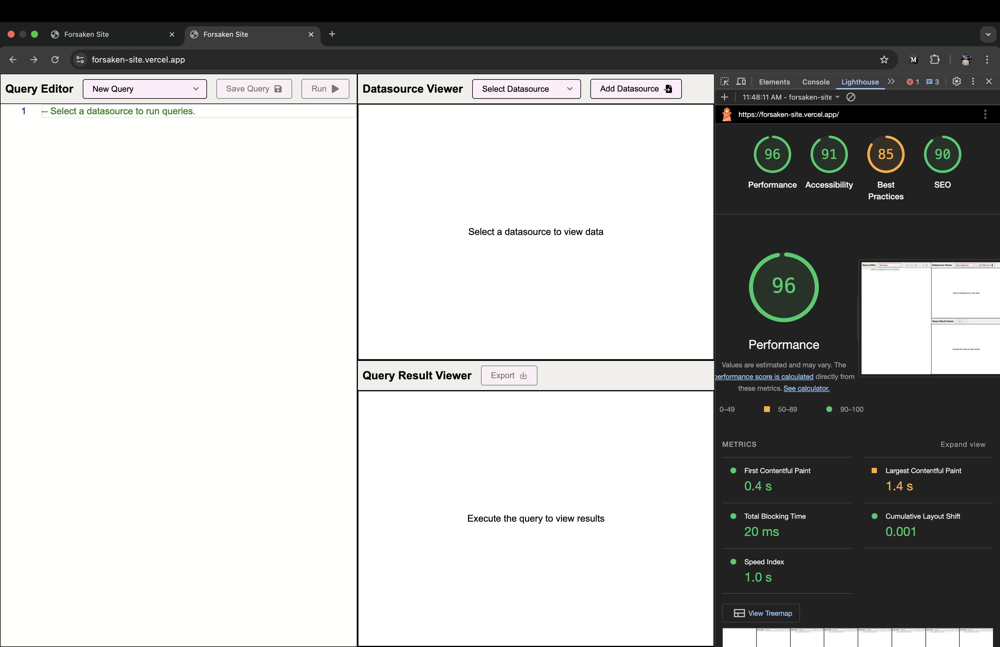

# Forsaken Site

A modern web application that allows users to interact with and analyze data through SQL queries. The application provides a user-friendly interface for managing data sources, writing SQL queries, and visualizing query results.

## Features

- Import and manage multiple data sources
- Monaco-based SQL editor with syntax highlighting
- Query execution capabilities using mock data
- Save queries and update them
- Tabular display of query results with simple pagination
- Export functionality for results

## Tech Stack

- **Frontend Framework**: React 19
- **Build Tool**: Vite
- **Language**: TypeScript
- **State Management**: Zustand
- **Styling**: Styled Components
- **Code Editor**: Monaco Editor
- **Icons**: React Icons
- **Profiling**: React Scan

## Project Structure

```
src/
├── components/
│   ├── DatasourceSection/    # Data source management UI
│   ├── QueryEditor/         # SQL query editor component
│   ├── QueryResultViewer/   # Query results display
│   └── ui/                  # Reusable UI components
├── stores/
│   ├── datasource.store.ts  # Data source state management
│   └── queries.store.ts     # Query state management
├── utils/
│   ├── dataLoader.ts       # Data loading utilities
│   ├── export.ts          # Export functionality
│   └── query.ts           # Query execution utilities
└── App.tsx                # Main application component
```

## Getting Started

### Prerequisites

- Node.js (Latest LTS version recommended)
- npm package manager

### Installation

1. Clone the repository:

```bash
git clone [repository-url]
cd forsaken-site
```

2. Install dependencies:

```bash
npm install
```

3. Start the development server:

```bash
npm run dev
```

The application will be available at `http://localhost:5173`

### Available Scripts

- `npm run dev` - Start development server
- `npm run build` - Build for production
- `npm run preview` - Preview production build
- `npm run lint` - Run ESLint
- `npm run scan` - Run development server with profiling tools from react-scan

## Usage

1. **Managing Data Sources**

   - Use the "Add Data Source" button to import or configure your data sources
   - View your datasource in a table view with pagination

2. **Writing Queries**

   - Use the SQL editor to write and execute queries
   - User can save queries for easy access in future using "Save Query" button
   - User can edit saved queries using the same button

3. **Viewing Results**
   - Query results are displayed in a tabular format with pagination
   - Export results to csv file using "Export" button
   - Shows a dummy execution time for query

## Performance Metrics

Here are the key performance metrics:



- Chrome Devtools Lighthouse
  - **First Contentful Paint**: ~0.4 seconds
  - **Largest Contentful Paint**: ~1.4 seconds
  - **Total Blocking time**: 20ms
- `useGetPerformance` hook
  - Custom hook that uses `window.performance` API to calculate time to render a component
  - `Time to render = endTime - startTime`
  - **`App` component initial load/render time**: ~135ms
- React-Scan
  - Library which helps in profiling a react application, it continously displays frames per second and alerts any frame drops in the app
  - Application runs at constant 60FPS for the entire time, rarely dropping to 40FPS

## Performance Optimizations

- Lazily load datasources
  - We have 10 inbuilt datasources that are loading according to user demand instead of loading all of them at once on initial page load
  - After a datasource is loaded it is cached for future uses, improving performance
- Table for Large datasets
  - With the help of `react-scan`, it was clear that the app was taking major frame drops while rendering tables with many rows
  - Implemented a simple pagination mechanism to prevent rendering all rows at once, reducing re-rendering elements on the screen
- Zustand selective states
  - Again with help of `react-scan`, I came to know that `Table` component was rendering twice in "Datasource Section" due to completely unrelated state change in "Query Store"
  - To avoid this, we can access only what's needed(a function for instance) instead of entire query store which holds frequently changing state for queries that is unrelated to "Datasource Section"

## Thanks

Thank you for checking out this project!

Happy querying! 🚀
