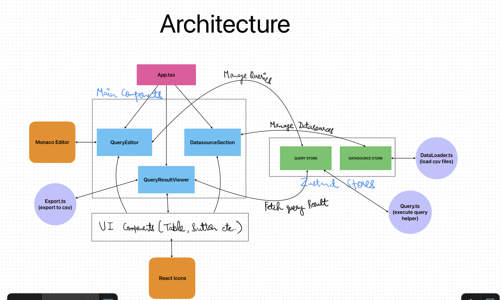

# Architecture Overview

This diagram illustrates the architecture of the Forsaken Site application, showing the relationships between different components, state management, and utilities.

## Key Components

1. **Frontend Application**

   - Root component (`App.tsx`) -- Defines Layout for main components
   - Main Components (DatasourceSection, QueryEditor, QueryResultViewer)
   - Reusable UI components

2. **State Management**

   - Datasource Store (manages data sources)
   - Query Store (manages queries and results)

3. **Utilities**

   - DataLoader (handles data loading)
   - Export (handles result export)
   - Query Utils (query execution)

4. **External Services**

   - Monaco Editor (SQL editor)
   - React Icons (UI icons)
   - React Scan (performance monitoring)

## Data Flow

1. Data sources are loaded through the Datasource Store
2. Queries are managed and executed through the Query Store
3. Results are displayed in the QueryResultViewer
4. Export functionality is available for query results

## Component Relationships

- The App component orchestrates the main layout and component composition
- UI Components interact with their respective stores for state management
- Utilities provide supporting functionality to both stores and components
- External services are integrated where needed for specific functionality
